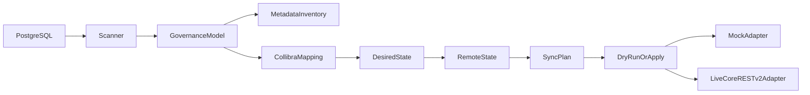

# collibra-governance-automation

Discover PostgreSQL technical metadata, export a deterministic governance inventory, map it into an inspectable Collibra-oriented desired state, compare against remote managed state, and apply safe plan-driven synchronization through a single CLI.

**Stack:** Python 3.12 · PostgreSQL 16 · Psycopg 3 · httpx · Docker Compose · MIT

**Release prep:** package version `1.0.0` is ready for tagging after merge. See [CHANGELOG.md](CHANGELOG.md). This repository state prepares `v1.0.0`; the Git tag and GitHub Release are created only after merge to `main`.

## What is implemented

```text
PostgreSQL metadata discovery
-> deterministic governance inventory
-> Collibra mapping
-> mock/live adapter boundary
-> deterministic diff
-> safe sync
-> CLI
```

| Area | Status |
| --- | --- |
| PostgreSQL discovery + vendor-neutral model | Real against local demo |
| Deterministic inventory export | Real |
| Collibra mapping + sync planning | Real, local |
| Mock Collibra adapter | Real, process-local, no external network |
| Live Collibra Core REST API v2 adapter | Contract-tested; no commercial tenant validation claimed |
| CLI (`scan` / `export` / `diff` / `sync`) | Real |
| Live tenant credentials / commercial validation | Not provided by this repository |

Central safety: sync defaults to dry-run (zero remote mutations). Writes require `--apply`. Live writes additionally require `--confirm-live`. No automatic deletes.



Neutral core owns discovery, inventory, mapping, and plan construction. Adapters are the integration boundary. Plans are built before any write.

## Quick start (clean checkout, mock)

No Collibra tenant is required.

### Bash / Linux / macOS / WSL / Git Bash

```bash
git clone https://github.com/fgnfmackk/collibra-governance-automation.git
cd collibra-governance-automation
python -m venv .venv
source .venv/bin/activate
python -m pip install --upgrade pip
pip install -e ".[dev]"
docker compose up -d --wait
governance scan
governance export
governance diff --mode mock
governance sync --mode mock
governance sync --mode mock --apply
docker compose down -v
```

### PowerShell / Windows

```powershell
git clone https://github.com/fgnfmackk/collibra-governance-automation.git
cd collibra-governance-automation
python -m venv .venv
.venv\Scripts\Activate.ps1
python -m pip install --upgrade pip
pip install -e ".[dev]"
docker compose up -d --wait
governance scan
governance export
governance diff --mode mock
governance sync --mode mock
governance sync --mode mock --apply
docker compose down -v
```

Copy `.env.example` to `.env` only when local overrides are needed. Defaults match the Docker Compose demo. Collibra defaults to mock mode.

Optional Bash helper for the SQL demo contract: `bash sample/verify_demo.sh` (Bash / WSL / Git Bash).

## CLI

```text
governance scan
governance export [--output PATH]
governance diff [--mode mock|live] [--mapping-config PATH] [--json]
governance sync [--mode mock|live] [--mapping-config PATH] [--apply] [--confirm-live] [--json]
governance --help
governance --version
```

Exit codes:

- `0` — completed successfully
- `1` — operational / configuration / integration failure
- `2` — usage / argument / live-apply confirmation error

`create` / `update` / `unchanged` / `remote_only` counts are plan actions, not completed remote writes. Dry-run means zero remote mutations (`applied=0`); it does not mean zero network in live mode.

### Representative local output (mock demo)

```text
governance 1.0.0
```

```text
source=governance-demo
database=governance_demo
schemas=2
tables=7
columns=41
primary_keys=7
foreign_keys=7
relationships=7
```

```text
mode=mock
create=108
update=0
unchanged=0
remote_only=0
writes=0
CREATE column col:governance-demo/governance_demo/commerce/customers/customer_id
CREATE table tbl:governance-demo/governance_demo/commerce/customers
CREATE relationship rel:fk:tbl:governance-demo/governance_demo/commerce/orders/orders_customer_id_fkey
```

A standalone mock `diff` starts from an empty mock adapter, so the plan commonly lists `CREATE` actions for the desired state. Mock state is process-local and is not persisted between CLI invocations.

```text
mode=mock
dry_run=true
create=108
update=0
unchanged=0
remote_only=0
applied=0
success=true
```

## Mock vs live

### Mock

- Zero external network
- Uses symbolic `mock:*` mapping refs
- No Collibra credentials
- Suitable for Quick Start and CI

### Live

- Uses existing Settings/env auth (`COLLIBRA_BASE_URL` plus Basic or Bearer)
- Requires `--mapping-config PATH` with tenant catalog refs only (no credentials in that file)
- `diff` and dry-run `sync` may perform GET/read calls against remote managed state
- Remote mutations require both `--apply` and `--confirm-live`
- Contract-tested; commercial tenant validation is not claimed

Example mapping shape: [`sample/collibra-mapping.example.json`](sample/collibra-mapping.example.json). Placeholders such as `<tenant-domain-id>` are intentionally non-functional and are rejected by the live CLI until replaced.

## Live usage

Configure auth in the environment (not on the command line):

```text
COLLIBRA_MODE=live
COLLIBRA_BASE_URL=https://your-collibra-host.example
COLLIBRA_USERNAME=...
COLLIBRA_PASSWORD=...
# or COLLIBRA_BEARER_TOKEN=...
```

Use a real mapping file derived from the sample placeholders:

```bash
governance diff \
  --mode live \
  --mapping-config tenant-mapping.json

governance sync \
  --mode live \
  --mapping-config tenant-mapping.json

governance sync \
  --mode live \
  --mapping-config tenant-mapping.json \
  --apply \
  --confirm-live
```

Dry-run first. Live dry-run may read remote state; it does not POST/PATCH/DELETE.

## PostgreSQL demo

```bash
docker compose up -d --wait
```

Local credentials are fictional and development-only:

| Setting | Value |
| --- | --- |
| Host | `localhost` |
| Port | `5432` |
| Database | `governance_demo` |
| User | `postgres` |
| Password | `postgres` |
| Logical source | `governance-demo` |

Primary demo schema: `commerce` (`customers`, `products`, `employees`, `orders`, `order_items`, `payments`, `marketing_contacts`). Seed data is synthetic (`@example.com`).

## Library seams

The CLI orchestrates the same public layers available to library callers:

```python
from governance.config import load_settings
from governance.exporters import MetadataInventory, write_inventory
from governance.integrations.collibra import (
    build_collibra_adapter,
    build_sync_plan,
    execute_sync_plan,
    map_to_desired_state,
    mock_mapping_config,
)
from governance.scanner import PostgresMetadataScanner

settings = load_settings()
model = PostgresMetadataScanner(settings).scan()
inventory = MetadataInventory.from_model(model)
write_inventory(inventory, settings.inventory_output_path)

desired = map_to_desired_state(model, mock_mapping_config())
adapter = build_collibra_adapter(settings, mock_mapping_config())
remote = adapter.read_remote_state(desired)
plan = build_sync_plan(desired, remote)
dry_run = execute_sync_plan(adapter, plan, apply=False)
```

## Repository structure

```text
src/governance/
  domain/                 vendor-neutral governance model
  scanner/                PostgreSQL metadata discovery
  exporters/              deterministic inventory JSON
  integrations/collibra/  mapping, adapters, sync planning
  cli.py                  argparse CLI orchestration
tests/
sample/                   demo SQL, verification helper, mapping example
.github/workflows/        CI quality gates
```

## Testing and CI

```bash
ruff check src tests
ruff format --check src tests
pytest -m "not integration and not collibra_integration and not cli_integration"
python -m build
```

With the demo database running:

```bash
pytest -m integration
pytest -m collibra_integration
pytest -m cli_integration
docker compose down -v
```

CI defines seven `ubuntu-latest` jobs:

- `lint`
- `unit-tests`
- `package-validation`
- `postgres-integration`
- `metadata-integration`
- `collibra-integration`
- `cli-integration`

No commercial Collibra tenant, self-hosted runners, or OS matrix is required.

## Limitations

- No commercial Collibra tenant validation
- No OAuth acquisition/refresh
- No automatic deletes
- No arbitrary tenant customization beyond configured refs
- No transactional REST snapshot across concurrent mutations
- No large-scale performance benchmark
- Mock state is process-local demonstration state
- Demo data is fictional

## License

[MIT](LICENSE)
