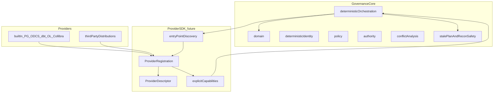
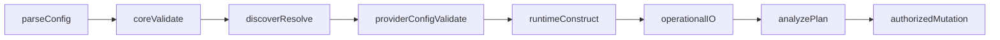

# Provider SDK v2 — Architecture and Compatibility Contract

- **Status:** Normative architecture contract
- **Package version at freeze:** `collibra-governance-automation` `1.4.0`
- **Epic:** [#19 — Publish the provider SDK and extension ecosystem](https://github.com/adrianmartnez/collibra-governance-automation/issues/19)
- **Issue:** [#89 — Define the v2 Provider SDK architecture and compatibility contract](https://github.com/adrianmartnez/collibra-governance-automation/issues/89)
- **PR sequence:** 1/6 of v2.0 (`Provider Ecosystem`); foundation implementation is PR 2/6 (#90–#92)

> **Implementation state:** This document freezes architectural decisions for the Provider SDK.
> The public foundation under `governance.providers` (SDK API version `1`, registry, and entry-point
> discovery) is implemented against this contract. Built-in integrations are not yet migrated;
> CLI/Action/config v1 behavior remains unchanged. Issues #93–#101 MUST continue to implement
> against this contract and MUST NOT redefine its fundamental semantics.
> Public reference: [docs/providers/sdk-reference.md](../providers/sdk-reference.md).

Language in this document uses **MUST / MUST NOT / SHOULD / MAY** with normative force for future
implementation. Statements about current v1.4 behavior are descriptive and tagged as such.

---

## 1. Purpose

Freeze the architectural and compatibility decisions that define the v2 Provider SDK **before**
implementation begins, so that:

1. a third party can later implement a provider using only the public Provider SDK;
2. package it as an independent Python distribution;
3. register it through Python entry points;
4. install it without modifying this repository;
5. declare identity and SDK compatibility;
6. declare capabilities explicitly;
7. be discovered and resolved deterministically;
8. participate in supported workflows when required capabilities are present;
9. execute the public conformance kit;
10. coexist with built-in providers under the same contracts.

This document is the normative reference for PRs that deliver #90–#101.

---

## 2. Scope

### In scope (this contract)

- Capability-based Provider SDK architecture
- Provider identity and duplicate-ID semantics
- Provider descriptor and `ProviderRegistration` shape
- Stable capability taxonomy and composition rules
- Python entry-point discovery contract
- Provider SDK API compatibility model
- Lifecycle phases and side-effect boundaries
- Configuration ownership (core vs provider) for future `governance.yaml` v2
- Built-in vs third-party registration semantics
- Trust / security model
- Machine-contract preservation policy
- CLI and GitHub Action compatibility expectations
- v1.4 → v2.0 migration compatibility commitments
- Packaging boundaries for v2.0
- Explicit non-goals and implementation sequence

### Out of scope (this PR / this document as implementation)

- Implementing `governance.providers` types, registry, or discovery
- Implementing `governance.yaml` v2
- Migrating PostgreSQL / ODCS / dbt / OpenLineage / Collibra to provider registration
- Refactoring CLI or reconciliation source composition
- Conformance kit, external provider package, Action behavior changes
- Changing package version, runtime version, or machine-contract schemas
- Preparing the v2.0.0 release

---

## 3. Terminology

| Term | Meaning |
| --- | --- |
| **Core** | Governance engine responsibilities owned by this package: domain semantics, identity, policy, authority, conflicts, stale-plan protection, reconciliation safety, mutation authorization, orchestration, artifact/machine-contract versioning |
| **Provider** | A registered extension that contributes one or more **capabilities** |
| **Built-in provider** | A provider whose implementation ships inside `collibra-governance-automation` |
| **External / third-party provider** | A provider distributed as an independent Python package and discovered via entry points |
| **Capability** | An explicit, named technical role a provider declares (see §7) |
| **ProviderDescriptor** | Public metadata describing identity, versions, SDK compatibility, and declared capabilities |
| **ProviderRegistration** | Object returned by an entry-point callable: descriptor plus factories/bindings for declared capabilities |
| **Provider SDK API** | The public Python contracts under the future `governance.providers` namespace |
| **Provider SDK API version** | Compatibility version of those contracts; independent of package SemVer and machine contracts |
| **Machine contract** | Versioned artifact/schema/result contracts (snapshots, plans, observations, Action results, etc.) |
| **Operational I/O** | HTTP, database connections, remote filesystem access, secret materialization used for runtime work, and other side-effecting I/O beyond loading Python modules / reading packaging metadata |
| **Discovery** | Loading and validating installed provider registrations (metadata/registration only) |
| **Resolution** | Selecting and validating providers for a concrete operation (explicit selection + capability checks) |

---

## 4. Architectural principles

1. **Capability-based extension.** Providers are composed from explicit capabilities. The SDK MUST NOT define a monolithic `BaseProvider` that forces every integration into a symmetric interface.
2. **Stable core ownership.** Providers MUST NOT own core governance semantics (authority, conflicts, policy, deterministic identity, stale-plan validation, mutation authorization, reconciliation safety).
3. **Explicit over inferred.** Capability negotiation MUST use declared capability IDs and typed bindings. The core MUST NOT infer behavior via provider name, duck typing, `hasattr()`, or silent fallback.
4. **Deterministic failure.** Duplicate IDs, unknown capabilities, SDK incompatibility, and invalid discovery state MUST fail closed with deterministic diagnostics.
5. **No privileged built-ins.** Built-in and external providers use the same public registration and capability contracts. Built-ins MUST NOT bypass core safety boundaries.
6. **Independent version axes.** Package SemVer, Provider SDK API compatibility version, provider package version (PEP 440), and machine-contract versions are independent.
7. **Trust without sandbox claims.** Installed providers are trusted Python code. Conformance is not a security audit.

### Target architecture (future)

```text
Governance Core
│
├── domain
├── deterministic identity
├── policy
├── authority
├── conflict analysis
├── observations
├── lineage / impact
├── plans
├── stale-plan protection
├── reconciliation safety
│
└── Provider SDK  (governance.providers; foundation landed in #90–#92)
     ├── provider descriptor / identity
     ├── SDK compatibility
     ├── capabilities
     ├── registration
     ├── discovery
     └── configuration boundary
```



### Current v1.4 vs target v2

| Aspect | Pre-#90 (v1.4) | After foundation (#90–#92) / remaining v2 work |
| --- | --- | --- |
| Public Provider SDK | None | `governance.providers` landed (SDK API `1`); built-ins not yet registered |
| Source composition | Hardcoded imports (e.g. reconciliation sources know ODCS/dbt/OpenLineage) | Still hardcoded until provider-driven orchestration (#95–#98) |
| Config | `governance.yaml` v1 (`sources.provider=postgresql`, `targets.provider=collibra`) | Still v1; v2 additive provider config in #93/#94 |
| Discovery | N/A | `discover_providers()` via entry points group `governance.providers` |
| Collibra/PG packaging | In-repo integrations | Remain in-repo as built-ins for v2.0 |

Hardcoded composition in v1.4 is acknowledged and is **intentionally not refactored** by the PR that lands this document.

---

## 5. Provider identity

### Format

- A `provider_id` MUST match: `^[a-z][a-z0-9_]*(\.[a-z][a-z0-9_]*)*$`
- Examples: `postgresql`, `odcs`, `dbt`, `openlineage`, `collibra`, `acme.snowflake`
- The `provider_id` is the stable public identity used for selection, diagnostics, and deterministic ordering.

### Uniqueness and duplicates

- Within a process discovery/resolution result, `provider_id` MUST be unique across built-in and external providers.
- If two registrations claim the same `provider_id`, the core MUST raise a deterministic error.
- The core MUST NOT resolve duplicates by any of:
  - built-in wins
  - external wins
  - first imported wins
  - last imported wins
  - installation order
  - entry-point name order as precedence (ordering for enumeration is defined separately and MUST NOT imply winner selection)

### Deterministic enumeration order

After a successful discovery that yields a valid set of unique providers, enumeration MUST be sorted lexicographically by `provider_id`.

Lexicographic enumeration order MUST NOT imply execution precedence or automatic selection.

### Explicit selection

When an operation needs a specific provider, selection MUST be explicit (configuration and/or CLI / Action inputs as defined in later issues). Discovery alone MUST NOT choose a “default winner” among multiple providers.

---

## 6. Provider descriptor

A `ProviderDescriptor` is the public metadata surface required for discovery without operational work.

### Required conceptual fields

| Field | Semantics |
| --- | --- |
| `provider_id` | Stable identity (§5) |
| `display_name` | Human-oriented label |
| `provider_version` | Version of the provider distribution using **PEP 440** semantics (not required to be strict SemVer) |
| `sdk_compatibility` | Range of **Provider SDK API** versions the provider supports (§10) |
| `capabilities` | Explicit list of capability IDs from the taxonomy (§7) |

### Rules

- Descriptors MUST NOT require operational I/O to construct.
- Descriptors MUST NOT include speculative fields (vendor trust scores, sandbox claims, Collibra-specific transport metadata, etc.).
- `provider_version` MUST NOT be confused with:
  - `collibra-governance-automation` package version
  - Provider SDK API compatibility version
  - machine-contract versions

---

## 7. Capability taxonomy

Capabilities reflect real roles already present in the repository. They are the stable public IDs for declaration and negotiation.

### Source-side

| Capability ID | Meaning | v1.4 examples (descriptive) |
| --- | --- | --- |
| `metadata_discovery` | Produce technical/discovered metadata usable by inventory/snapshots | PostgreSQL scanner |
| `governance_graph` | Produce a `GovernanceGraph` | ODCS, dbt, OpenLineage mappers |
| `property_observations` | Produce property observations / provenance | ODCS, dbt, OpenLineage |
| `lineage` | Produce lineage assertions/edges | dbt, OpenLineage |

### Target-side

| Capability ID | Meaning | v1.4 examples (descriptive) |
| --- | --- | --- |
| `remote_state_read` | Read managed remote governance state | Collibra remote-state read |
| `target_planning` | Mapping / planning boundary producing desired or plan-ready structures without mutation | Collibra mapping + sync plan build |
| `compatibility_preflight` | Read-only compatibility / transport / auth readiness checks | `governance preflight` |
| `authorized_mutation` | Execute a mutation **only when** the core delivers an already-authorized mutation workflow | Collibra sync/import execution paths |

### Composition semantics (normative)

1. Each capability MUST be declared explicitly in the descriptor.
2. No capability automatically implies any other capability.
3. The core MUST NOT infer capabilities from class hierarchy, method presence, provider name, or `hasattr()`.
4. Each core operation MUST declare the set of capabilities it requires and MUST check that set explicitly.
5. A provider MAY declare any subset of known capability IDs.
6. The taxonomy MUST NOT introduce artificial source↔target dependencies (a source provider need not declare target capabilities and vice versa).
7. Unknown capability IDs MUST be rejected deterministically.
8. Duplicate capability IDs within a single descriptor are invalid and MUST be rejected deterministically.
9. For v2.0, there is **no additional dependency matrix** among capability combinations beyond the rules above. Any subset of known IDs is valid at declaration time.
10. `authorized_mutation` means only that the provider can execute a mutation the core has already authorized. Declaring `authorized_mutation` NEVER constitutes authorization, NEVER bypasses stale-plan checks, and NEVER legitimizes writes in read-only workflows.

### Collibra-specific concepts excluded from the generic SDK

The following remain implementation details of the Collibra provider (or successor internal modules) unless a future issue deliberately promotes a truly generic abstraction:

- Collibra OAuth specifics
- Import API v2
- sync_v2
- Collibra job polling
- Collibra batching
- Collibra-specific resource IDs

---

## 8. Registration

### `ProviderRegistration` (conceptual)

An entry-point callable returns exactly one `ProviderRegistration`, which MUST contain:

- the `ProviderDescriptor`;
- factories / bindings required to construct the declared capabilities’ runtime collaborators **later**.

Creating a `ProviderRegistration` MUST NOT:

- construct operational clients (HTTP, DB drivers ready to talk to remotes, etc.);
- perform HTTP;
- perform database I/O;
- resolve secrets to live credentials for operational use;
- perform operational filesystem work beyond what Python import/packaging requires.

#90 MUST materialize `ProviderDescriptor`, `ProviderRegistration`, capability identifiers, and related public types in Python. #90 MUST NOT change this conceptual shape.

Built-in providers MUST register through the same public registration concepts as external providers (implementation mechanism for built-ins is an #91/#95 detail; privilege bypass is forbidden).

---

## 9. Entry-point discovery

### Entry-point group

- Group name: `governance.providers`

### Object contract

1. Each entry point MUST resolve to a callable that takes **no arguments**.
2. That callable MUST return exactly one `ProviderRegistration` (§8).
3. Invoking the callable is part of discovery/registration metadata loading and remains subject to side-effect rules (§12): it MUST NOT perform operational I/O.

### Discovery behavior

- Discovery is metadata/registration only.
- Discovery MUST NOT perform HTTP, DB I/O, operational filesystem scanning, secret resolution, or mutation.
- After successful loads, providers are enumerated in lexicographic `provider_id` order.
- Duplicate `provider_id` values MUST fail closed (§5).
- SDK-incompatible providers MUST fail closed before operational use (§10).
- Discovery MUST NOT auto-select a provider as a fallback winner.

### Broken entry points (normative requirement for #92)

1. An entry point that cannot be loaded MUST produce a **deterministic diagnostic**.
2. An operation that requires constructing/resolving the provider registry MUST fail safely if the discovery state required for that operation is invalid.
3. `governance --help`, version/help surfaces, and commands that do **not** need to initialize providers MUST NOT break solely because an unrelated defective external provider is installed.
4. The core MUST NOT silently ignore errors during an operation that actually requires that provider (or a valid registry state for the operation).
5. The core MUST NOT automatically choose another provider as fallback.

### Trust note for installation

Installing a provider package means trusting that package as with any other installed Python dependency. See §17.

#92 implements discovery against this contract and MUST NOT redefine these semantics.

---

## 10. Compatibility

### Provider SDK API compatibility

- The Provider SDK API has its own compatibility version axis.
- That axis is independent of:
  - package SemVer of `collibra-governance-automation`;
  - snapshot versions;
  - plan versions;
  - observation versions;
  - history / drift / comparison / impact versions;
  - other machine contracts.
- **Initial Provider SDK API version (frozen for first publication in #90):** `1`  
  Represented as the PEP 440 version string `"1"`. Providers targeting the initial public SDK MUST declare an `sdk_compatibility` range that includes version `1` (for example a specifier-set-compatible range such as `==1` or `>=1,<2`, as materialized by #90’s public helpers — the helpers MUST NOT change this initial version value).
- Subsequent intentional SDK API breaks MUST bump this compatibility version deliberately; they are not implied by package SemVer bumps.
- `sdk_compatibility` on the descriptor is the range of Provider SDK API versions the provider declares support for.
- The concrete representation MUST be compatible with Python packaging version/specifier semantics (PEP 440 versions and specifier-set-compatible ranges).
- Before using a provider operationally, the core MUST compare its Provider SDK API version against the provider’s `sdk_compatibility` range.
- Incompatibility MUST be a deterministic, fail-closed error and MUST occur before operational I/O.
- The Provider SDK API version is **not required** to equal package version `2.0.0` (and initially MUST be `1`, not `2`).
- #90 implements types/constants for this model (including publishing the constant for API version `1`) and MUST NOT redefine these rules or choose a different initial value.

### Package SemVer vs machine contracts

Publishing `collibra-governance-automation 2.0.0` MUST NOT, by itself, require bumping snapshots, plans, observations, history, drift, comparison, impact, or other machine contracts to a new major version. Contract revisions happen only through deliberate, versioned changes.

---

## 11. Lifecycle

Conceptual phases for provider-aware operations:

| # | Phase | Side-effect class |
| --- | --- | --- |
| 1 | Core configuration parsing | Read-only |
| 2 | Core schema / semantic validation | Read-only |
| 3 | Provider discovery / resolution | Read-only; no operational I/O |
| 4 | Provider-specific config validation | Read-only; MUST NOT mutate remote/local governed state |
| 5 | Runtime construction | **MUST NOT** perform operational I/O |
| 6 | Operational I/O | Capability-scoped I/O may begin |
| 7 | Core analysis / planning | MUST NOT perform remote governance mutation |
| 8 | Explicit authorized mutation | Only inside core-authorized mutation workflows |



Phases 1–5 MUST complete before phase 6. Importing modules and building `ProviderRegistration` objects is not a license to open remote connections.

---

## 12. Side-effect rules

### Read-only obligations

Conforming providers MUST treat the following as non-mutating with respect to remote governance state:

- discovery / registration creation
- provider-specific config validation
- runtime construction
- source capabilities used in read-only workflows (`metadata_discovery`, `governance_graph`, `property_observations`, `lineage` as consumed by analysis)
- `remote_state_read`, `target_planning`, `compatibility_preflight`
- core analysis and planning

### Mutation

- Remote governance mutation MAY occur only in phase 8 under core authorization.
- Declaring `authorized_mutation` is insufficient for mutation.
- Read-only workflows (including current v1.4 impact, explain, compare, drift, history, review, and preflight) MUST perform zero remote governance mutations.

### Secrets

- Secrets remain indirect configuration (for example env indirection) and MUST NOT enter deterministic artifacts.
- Public diagnostics MUST remain secret-safe.

---

## 13. Configuration ownership

Future `governance.yaml` v2 (implemented in #93/#94; ownership frozen here):

### Core owns

- schema version
- profiles
- overlay / merge semantics
- provider selection
- environment indirection policy
- lifecycle of resolution
- deterministic normalization
- top-level configuration structure

### Provider owns

- validation of its delimited provider-specific payload
- interpretation of that payload for its capabilities **after** core resolution hands it over

### Providers MUST NOT control

- profile merge semantics
- global config resolution
- secret resolution policy
- mutation authorization

### Compatibility commitment

`governance.yaml` **v1** MUST remain supported in v2.0. This architecture PR does not change the current loader or schema.

---

## 14. Built-in provider semantics

Built-in providers planned for the ecosystem (registration in later issues):

- `postgresql`
- `odcs`
- `dbt`
- `openlineage`
- `collibra`

Rules:

- Built-ins MUST use the same public registration / capability contracts as third parties.
- Built-ins MUST NOT receive implicit precedence over external providers.
- Built-ins MUST NOT bypass stale-plan protection, conflict blocking, policy evaluation, or mutation gates.
- For v2.0, PostgreSQL and Collibra MUST remain implemented inside this repository (not extracted to separate distributions).

---

## 15. Third-party provider semantics

Third-party providers:

- ship as independent Python distributions;
- expose an entry point in group `governance.providers`;
- return `ProviderRegistration` from a no-argument callable;
- declare identity, PEP 440 `provider_version`, `sdk_compatibility`, and capabilities;
- participate only when explicitly selected / required and capability checks pass;
- are trusted code once installed (§17);
- SHOULD pass the public conformance kit (#99) — conformance does not imply vendor, production, or security certification.

---

## 16. Target-provider boundary

- Target capabilities (`remote_state_read`, `target_planning`, `compatibility_preflight`, `authorized_mutation`) define the generic boundary.
- Collibra is the reference target implementation for v2.0 (#97).
- Mapping/planning constructs desired or plan-ready structures; they MUST NOT mutate remote state.
- Mutation execution is a separate capability invoked only under core authorization.
- Introducing additional governance targets is **not** a goal of the initial v2.0 Provider SDK delivery sequence.

---

## 17. Trust / security model

Normative statements:

1. Installed providers are **trusted Python dependencies**.
2. There is **no** security sandbox isolating provider code from the process.
3. Conformance testing is **not** an audit for malicious code.
4. Conformance is **not** vendor certification.
5. Conformance is **not** production certification.
6. Conformance is **not** performance certification.
7. Conforming providers MUST respect lifecycle and side-effect contracts; that obligation is behavioral conformance, not isolation against malice.

---

## 18. Machine-contract compatibility

### Policy

- Existing public machine contracts remain on their current versions unless a future issue deliberately introduces a new contract version.
- Package SemVer `2.0.0` alone MUST NOT rev these contracts.
- This architecture PR MUST NOT modify schema files or contract constants.

### JSON Schema contracts preserved (current filenames)

| Contract schema | Version axis |
| --- | --- |
| `governance-config.v1.schema.json` | config v1 |
| `governance-policy.v1.schema.json` | v1 |
| `governance-authority.v1.schema.json` | v1 |
| `governance-plan.v1.schema.json` / `governance-plan.v2.schema.json` | plan v1 readable; v2 current for new plans |
| `governance-snapshot.v1.schema.json` | v1 |
| `governance-property-observations.v1.schema.json` | v1 |
| `governance-snapshot-comparison.v1.schema.json` | v1 |
| `governance-comparison-diagnostics.v1.schema.json` | v1 |
| `governance-drift-policy.v1.schema.json` | v1 |
| `governance-drift-result.v1.schema.json` | v1 |
| `governance-drift-diagnostics.v1.schema.json` | v1 |
| `governance-history.v1.schema.json` | v1 |
| `governance-history-diagnostics.v1.schema.json` | v1 |
| `governance-history-evolution.v1.schema.json` | v1 |
| `governance-impact-changes.v1.schema.json` | v1 |
| `governance-impact-result.v1.schema.json` | v1 |
| `governance-explain-result.v1.schema.json` | v1 |
| `governance-explain-diagnostics.v1.schema.json` | v1 |
| `governance-reconciliation-diagnostics.v1.schema.json` | v1 |
| `governance-action-result.v1.schema.json` | v1 |
| `governance-ci-review-result.v1.schema.json` | v1 |

### Representative in-code contract versions also preserved under this policy

Including (non-exhaustive): hashing contract, scanner contract, planner contract, Action `CONTRACT_VERSION`, and related diagnostics/result version constants currently at version `1` (or their existing documented values). They are not automatically bumped by the package becoming 2.x.

---

## 19. CLI compatibility

v2.0 MUST continue to support the existing CLI surface used in v1.4, including:

- existing commands and workflows;
- legacy source flags used today for ODCS / dbt / OpenLineage composition;
- dry-run defaults and explicit apply / live confirmation gates.

Provider-driven orchestration (#96/#98) MUST be introduced without removing these compatibility paths in v2.0.

Commands that do not need providers MUST remain usable even if an unrelated external provider entry point is broken (§9).

---

## 20. GitHub Action compatibility

v2.0 MUST continue to support existing GitHub Action:

- operations (`validate`, `check`, `plan`, `impact`, `review`);
- existing inputs and outputs unless an additive path is introduced (#101 may add provider-neutral inputs **additively**).

Action safety semantics (read-only impact/review; secret-safe public surfaces) MUST be preserved.

---

## 21. Migration compatibility commitments (v1.4 → v2.0)

The following MUST remain supported in v2.0:

- `governance.yaml` v1
- existing CLI
- legacy source flags
- existing GitHub Action operations
- existing GitHub Action inputs
- existing snapshots
- supported saved plans
- observations
- authority
- impact
- comparison
- drift
- history
- existing deterministic identities where applicable
- Collibra safety semantics (dry-run default, plan-before-apply, stale-plan protection, conflict blocking, no automatic deletes)

The Provider SDK MUST NOT introduce accidental breaking changes to these commitments.

### Safety invariants preserved by the architecture

- dry-run by default
- plan before apply
- stale-plan protection
- explicit apply authorization
- explicit live-write confirmation where currently required
- unresolved/ambiguous applicable conflicts block before writing
- no automatic destructive reconciliation
- read-only workflows perform zero remote governance mutations
- secrets are not part of deterministic artifacts
- public diagnostics remain secret-safe

No provider lifecycle hook may be specified as a legitimate bypass of these invariants.

---

## 22. Explicit non-goals

This architecture / PR sequence item (#89) does **not**:

- implement the Provider SDK;
- add entry-point discovery code;
- implement a registry;
- implement capability negotiation code;
- add `governance.yaml` v2;
- migrate PostgreSQL / ODCS / dbt / OpenLineage / Collibra to provider registration;
- refactor reconciliation source composition or CLI orchestration;
- abstract Collibra transport specifics into the generic SDK;
- add a second governance target;
- implement conformance;
- create an external provider package;
- change GitHub Action runtime behavior;
- change package or runtime version;
- modify machine-contract schemas;
- prepare the v2.0.0 release;
- claim sandboxing or malicious-plugin isolation;
- design a monolithic provider base class.

---

## 23. Expected implementation sequence (#90–#101)

| Issue | Role relative to this contract |
| --- | --- |
| **#90** | Materialize public Python types/constants (`governance.providers`) for descriptor, registration, capabilities, SDK compatibility. Does **not** redefine contracts frozen here. |
| **#91** | Deterministic registration + explicit capability negotiation using declared IDs. |
| **#92** | Implement entry-point discovery for group `governance.providers` with broken-entry-point semantics from §9. |
| **#93** | Extensible `governance.yaml` v2 provider configuration; keep v1 supported. |
| **#94** | Resolve provider configuration before operational I/O (phases 1–5 before 6). |
| **#95** | Register PostgreSQL, ODCS, dbt, OpenLineage as built-in source providers. |
| **#96** | Replace hardcoded source composition with provider-driven orchestration. |
| **#97** | Formalize target-provider boundary; Collibra as reference implementation. |
| **#98** | Extract provider execution orchestration from the CLI. |
| **#99** | Public conformance test kit. |
| **#100** | Prove third-party provider loading from an independent package. |
| **#101** | Provider-neutral Action support (additive) + provider-author documentation. |
| **#102** | Release preparation for v2.0.0 (separate PR). |

Planned PR grouping:

1. **PR 1 (this document)** — #89 architecture contract  
2. **PR 2** — #90 + #91 + #92 SDK foundation  
3. **PR 3** — #93 + #94 configuration v2  
4. **PR 4** — #95 + #96 + #97 + #98 provider-driven engine  
5. **PR 5** — #99 + #100 + #101 ecosystem proof  
6. **PR 6** — #102 release v2.0.0  

---

## Packaging boundaries (v2.0)

- The primary distribution remains `collibra-governance-automation`.
- The public Provider SDK lives inside that distribution (`governance.providers`).
- Collibra and PostgreSQL are **not** split into separate distributions for v2.0.
- External providers MAY be independent Python distributions.

---

## Document maintenance

This file is the normative architecture reference for the v2 Provider SDK until superseded by an explicit revision. Implementation PRs SHOULD link back here when applying these rules and MUST NOT silently weaken them.
